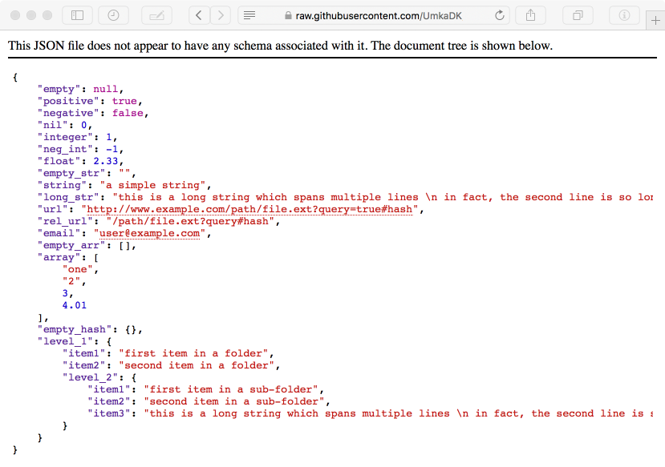

# JSON Navigator

**Version:** 1.0.1 release candidate  
**Status:** Fully functional, all tests are passing  
**Download:** [Stable release][apple_download] | [Latest build][github_download]  

## About JSONav

JSON Navigator (JSONav) is a Safari extension used to display JSON responses in a human-readable form: indented, syntax highlighted, with clickable links.

This extension is designed with the following goals in mind:

  - minimal size of the injected code

    Under no circumstances should this extension interfere with or slow down the browser.

  - minimal interference with the loaded content

    JSONav should be very conservative at choosing what pages to alter. It should only look at pages that are:

    - served over `http` or `https` protocols
    - identified as having JSON content either by *Content-Type* header (eg: `application/json`) or via the filename extension (ie: `.json`).

  - standard compliant, only valid content is highlighted

    This extension will only highlight valid JSON content. Thus, effectively validating JSON content returned by an endpoint.

  - close integration with the browser's eco-system

    JSONav looks and feels like part of the browser. Wherever possible it re-uses default fonts and styling providing a consistent and familiar interface established by the existing browser tools (eg: XML parser).

In short, JSONav is fast, minimalist, won't slow your system down, and if it isn't highlighting JSON content returned by a page then it is highly likely that there is a problem with the content!

## How to Install

The easiest way to install this extension is via Apple's Safari Extensions gallery:

  - [Safari Extensions Gallery][apple_download]

If you wish to try the latest development release of the extension then you can download it from the `build` directory of this project:

  - [Download the latest build][github_download]

## Build It Yourself

To do this you would have to be comfortable in a Terminal, as you might be required to diagnose and repair any potential build issues.

### Requirements

  - *Safari* -- obviously
  - *git* -- can be installed on MacOS with `xcode-select --install`
  - *npm* & *node* -- both can be installed on MacOS with `brew install node`
  - *PlistBuddy* -- comes pre-installed on MacOS as `/usr/libexec/PlistBuddy`

### Extension

First of all you would need to checkout this repository and it's sub-modules:

    git clone https://github.com/UmkaDK/JSONav.git

Then, use the following command to build an unpackaged and unsigned extension in the `JSONav.safariextension` directory of the project:

    npm install

To use the extension once built, you would also have to do both of the following:

 - allow the use of unsigned extensions in Safari:  
   *Safari Menu > Develop > Allow Unsigned Extensions*

 - install the extension via the extension builder:  
   *Safari Menu > Develop > Show Extension Builder > + > Add Extension...*

### Unit Tests

In order to run extension's unit tests you need to configure Safari to allow automation. As a feature intended for developers, Safari’s WebDriver support is turned off by default. To turn on WebDriver support, do the following:

  - Enable Developers Menu in *Safari > Preferences > Advanced*
  - Enable Remote Automation in the Develop menu by toggling *Develop > Allow Remote Automation* in the menu bar.

Once Remote Automation is enabled, you can run the tests with:

    npm test

## Frequently Asked Questions

* **Why does this extension require a full access to Webpage Contents and Browsing History?**

  The following warning is displayed when accessing this extension's preferences in *Safari Preferences > Extensions > JSON Navigator*:

  > **Webpage Contents**  
  > Can read sensitive information from webpages, including passwords, phone numbers, and credit cards on all web pages.
  >
  > **Browsing History**  
  > Can see when you visit all webpages.

  Safari Extension builder offers you a very limited set of controls over what pages an extension can or cannot access. The only options are:

  - None
  - Domain specific filter
  - All

  Since any URL on any domain can serve JSON content, we really don't have any choice but to request access to "All" pages.

  However, even though the extension has access to all pages, it only "looks at"  and "updates" the content of pages which are:

    - served over HTTP or HTTPS protocol

    - AND either the page URL or page ContentType header ends with "json"

  No other pages are examined, and the extension does not collect any data. As you can [see from the code](https://github.com/UmkaDK/JSONav/blob/master/JSONav.safariextension/inject/JSONav.js#L59-L73), it does not go anywhere near your passwords or credit card data.

* **Why is this extension distributed via Safari Extensions Gallery and not via the App Store?**

  Largely, it is a matter of personal preference: when an extension is distributed via the App Store it installs its icon among all the other Applications. After the extension is installed, the icon does nothing... not. a. thing.

  Personally, I don't like that. I do not think that Safari Extensions and Applications should mix. So early on in the design of the extension I've made the decision to go "Safari Extension Gallery" way.

## 3rd Party Libraries

JSON Navigator relies on a couple of 3rd party libraries to do the heavy lifting:

  - [isagalaev/highlight.js](https://github.com/isagalaev/highlight.js) - is used to provide syntax highlighting and colour themes (77 of them!).

  - [SoapBox/linkifyjs](https://github.com/SoapBox/linkifyjs) - is used to find links in plain-text and convert them to HTML `<a>` tags.

## Donations

This extension is 100% free and will never have any adds. It is distributed under the terms of the MIT license, which means that you're welcome to use it for private or commercial projects and to generally do whatever you want with it.

However, to sign this extension with a Safari Extension Certificated so that it "just works" in Safari, and to distribute it via Safari Extensions Gallery, I need to maintain a subscription to Apple Developer Program, [which is not free](https://developer.apple.com/programs/how-it-works/).

If you're feeling generous, and want to donate to my subscription fund, then your support will be greatly appreciated!

  
  &nbsp;
  

[apple_download]: https://safari-extensions.apple.com/?q=JSONav
[github_download]: https://jsonav.umka.dk/JSONav.safariextz
